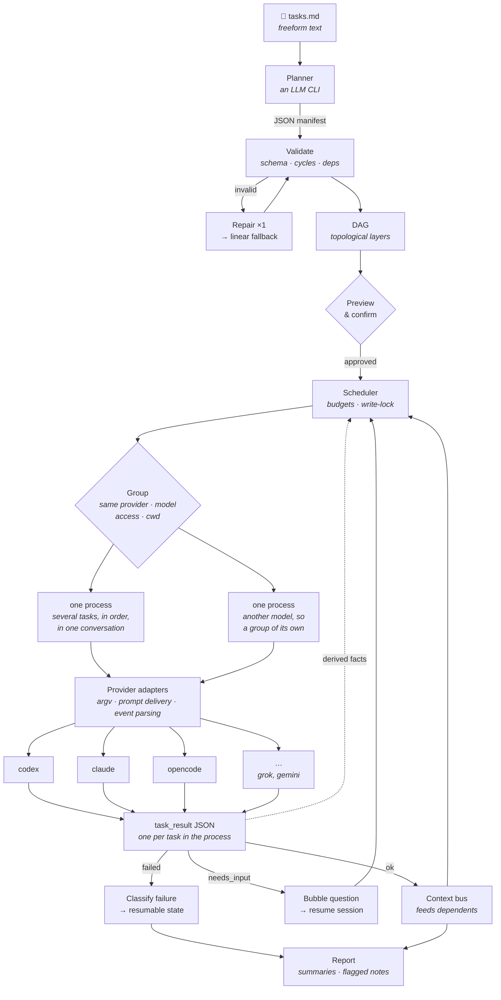

```
▗▄▄▖  ▗▄▖▗▖  ▗▖▗▄▖      ▗▄▄▖▗▖   ▗▄▄▄▖
▐▌ ▐▌▐▌ ▐▌▝▚▞▘▐▌ ▐▌    ▐▌   ▐▌     █         (º>
▐▛▀▚▖▐▛▀▜▌ ▐▌ ▐▛▀▜▌    ▐▌   ▐▌     █      //(  )
▐▙▄▞▘▐▌ ▐▌ ▐▌ ▐▌ ▐▌    ▝▚▄▄▖▐▙▄▄▖▗▄█▄▖     //¯\\

```

**Orchestrate local AI coding CLIs from a plain-text task list.**

[](https://github.com/juliomatcom/baya-cli/actions/workflows/ci.yml)
[](https://www.npmjs.com/package/baya-cli)
[](LICENSE)

Write what you want done in an ordinary text file — Markdown, a bare to-do list, YAML, whatever you already keep tasks in. Baya asks a model to turn it into a dependency graph, then routes each task to the AI coding CLI you already have installed and logged in — `codex`, `claude`, `copilot`, `opencode` — running independent work in parallel and piping each task's output into the ones that depend on it.

No config format to learn. No DSL. No API keys for every provider — it drives the CLIs you already pay for.

> [!WARNING]
> **Status: early.** The walking skeleton (M1) and provider breadth (M3) have landed — `codex`, `claude`, `opencode`, and `copilot` adapters, model-catalog resolution, and a sequential executor. Published to npm as [`baya-cli`](https://www.npmjs.com/package/baya-cli); concurrency and resume are still in progress. Follow along in [`specs/001/02-plan.md`](specs/001/02-plan.md).

---

## Install

```bash
npm install -g baya-cli   # binary: baya
```

Requires **Node 24+** and at least one supported CLI on your machine. Run `baya doctor` to see what it found.

## Usage

```txt
1 which model are you? - luna
2 which model are you? - sonnet
3 which model are you? - terra
```


📝 On first run `baya` asks once which provider and model to default to, stores it in `~/.config/baya/config.json`, and never asks again.

### The task list

Any UTF-8 text file. Baya's planner reads it for intent — the format is yours to pick.

**Markdown** — a heading for the goal, a bullet per task:

```markdown
# Ship the orders endpoint

- Design the REST API for orders. Use Sonnet.
- Generate the DB schema from that design.
- Build the React table that consumes it — run this with codex.
- Once the schema and UI are done, write integration tests.
```

**A bare `TODO.txt`** — one task per line, numbered or not:

```text
1 Design the REST API for orders. Use Sonnet.
2 Generate the DB schema from that design.
3 Build the React table that consumes it — run this with codex.
4 Once the schema and UI are done, write integration tests.
```

**YAML** — the same intent, laid out if you think better that way:

```yaml
- id: design-api
  task: Design the REST API for orders. Use Sonnet.
- id: gen-schema
  task: Generate the DB schema from that design.
  depends_on: [design-api]
- id: build-ui
  task: Build the React table that consumes the schema. Run with codex.
  depends_on: [gen-schema]
- id: tests
  task: Write integration tests for the endpoint.
  depends_on: [gen-schema, build-ui]
```

Baya never parses these structurally — the planner reads every format for intent, so `depends_on:` and plain prose like "once the schema and UI are done" get you the same graph. Empty or binary files are rejected before planning; if the planner can't produce a graph, a deterministic splitter falls back to a linear chain in the order you wrote the tasks.

## Features

- ✅ **Works out of the box** — zero config. One prompt on first run for your default provider, then never again.
- ✅ **Multi-provider** — routes each task to `codex`, `claude`, `copilot`, or `opencode`, the CLIs you already have installed and logged in.
- ✅ **Plain-text task lists** — Markdown, `TODO.txt`, YAML, whatever you already write. No config format, no DSL.
- ✅ **LLM-planned dependency graph** — a model turns your list into a DAG; a deterministic splitter falls back to a linear chain if it can't.
- ✅ **No API keys** — drives your existing CLI subscriptions; nothing new to pay for.
- ✅ **Model-per-task** — name `luna`, `sonnet`, etc. in the task text; Baya resolves it to the real id and the provider that serves it.
- ✅ **Parallel execution** — independent tasks run concurrently (`--max-parallel`); `read-write` tasks are serialized by a write-lock.
- ✅ **One process, many tasks** — tasks that share a provider, model and permission level are packed into a single agent process and worked through in order, so the repo is read once instead of once per task. `--group-size` (default 6), `--group-size 1` to opt out.
- ✅ **Doesn't pay twice** — what earlier tasks found (commands that worked, files changed) carries across to tasks that could not share a process. `--no-memory` to disable.
- ✅ **Preview gate** — see the full plan before anything runs; `--dry-run` shows it and runs nothing.
- ✅ **Resume** — checkpointed before every transition. Run out of credits mid-graph and `baya resume <runId>` picks up where it stopped, optionally on a different provider.

## How it works



Five ideas do most of the work:

- **JSON on the wire, both directions.** Every exchange with a provider is a validated envelope, never prose. `codex` and `claude` enforce the result schema natively. A question from an agent is a `status: "needs_input"` field — not a question mark spotted in a stream.
- **The planner picks a provider, never a command.** Manifests carry a provider name from a closed enum; adapters alone build `argv`. `shell: true` is banned repo-wide.
- **A process is the unit, not a task.** Tasks that share a provider, model, permission level and directory go into one agent process and are worked through in order — a whole layer of independent tasks, or a chain where each step builds on the last. That process orients itself once instead of once per task. This is decided separately from the DAG's shape, so the two do not line up: a six-stage chain is still one process, while one stage holding six tasks on six models is six.
- **Nothing paid-for is ever redone.** Progress is checkpointed before each transition. Run out of credits mid-graph and `baya resume <runId> --provider claude` picks up exactly where it stopped. Within a run, no task rediscovers what another already found: commands that worked, commands that failed, and files already touched are derived from the providers' own logs — costing nothing to produce — and handed to every later task.
- **Providers are watched, not trusted.** Their flag surfaces are live-probed and contract-tested, their output is ANSI-stripped and schema-validated.

## Providers

Verified 2026-08-28 by live invocation, not from documentation.

| Provider                                                | Non-interactive | Schema enforcement        | Status            |
| :------------------------------------------------------ | :-------------- | :------------------------ | :---------------- |
| [`codex`](https://github.com/openai/codex)              | `codex exec`    | ✅ file in / file out     | ✅ verified       |
| [`claude`](https://claude.com/claude-code)              | `claude -p`     | ✅ inline `--json-schema` | ✅ verified       |
| [`copilot`](https://github.com/github/copilot-cli)      | `copilot -p`    | ❌                        | ⚠️ partial        |
| [`opencode`](https://github.com/sst/opencode)           | `opencode run`  | ❌                        | ⚠️ partial        |
| [`gemini`](https://github.com/google-gemini/gemini-cli) | `gemini -p`     | ❌                        | deferred to v1.1  |
| `grok`                                                  | —               | —                         | planned, unprobed |

Full flag surfaces, event shapes, and capability matrix: [`wiki-llm/providers.md`](wiki-llm/providers.md).

## Repo layout

```
wiki-llm/     documentation — the source of truth
specs/001/    design record: what the original spec got wrong, and the plan
src/          the CLI, planner, providers, executor, memory
test/         unit · integration (fake provider) · contract (live CLIs)
```

## Documentation

[`wiki-llm/index.md`](wiki-llm/index.md) routes to everything — architecture, the JSON protocol, provider surfaces, execution semantics, recovery, logging, CLI reference, testing, and conventions.

Working on baya? Start with [`wiki-llm/conventions.md`](wiki-llm/conventions.md), then [`specs/001/02-plan.md`](specs/001/02-plan.md).

## Contributing

Contributions are welcome — the work is broken into 52 sequenced tasks in [`specs/001/02-plan.md`](specs/001/02-plan.md), each with its own done-criteria, so there is plenty that can be picked up independently.

Before opening a PR:

```bash
npm run typecheck && npm run lint && npm test
```

A few rules that are load-bearing rather than stylistic — the full list is in [`wiki-llm/conventions.md`](wiki-llm/conventions.md):

- No `shell: true`, ever. Spawns take `argv: string[]`.
- Never document a provider flag you have not actually run.
- Never regex a model's prose for meaning — semantics come from validated JSON.
- Update the affected `wiki-llm/` page in the same commit as the change.
- Read provider event shapes out of a recorded run in `.baya/runs/`, not out of a provider's docs.
- Tests never touch the network; the contract tier is opt-in via `BAYA_CONTRACT=1`.

Adding a provider is deliberately small: one adapter, one capability block, one section in `providers.md`, one contract test.

**Use Baya on Baya.** Every run leaves `.baya/runs/<runId>/` behind — real provider event streams, on a real repository, for free. That corpus is the best fixture set the project has: it is where the `codex` `file_change` bug was found, and where cross-task memory's first two heuristics were caught being wrong. Mine it before inventing an input, then pin what you find with a committed test. [`wiki-llm/testing.md`](wiki-llm/testing.md#dogfooding-your-own-runs-are-the-fixture-set) has the method. `.baya/` is gitignored and holds your prompts and source excerpts — evidence for you, never an issue attachment.

## Adding or overriding a model

Add model entries to `~/.config/baya/config.json` when a provider's catalog is missing a model or has stale metadata. `modelCatalog` is keyed by provider; each entry supplies the exact provider `id`, optional short `aliases`, and a one-line `description`:

```json
{
  "modelCatalog": {
    "copilot": [
      {
        "id": "vendor-model-slug",
        "aliases": ["short-name"],
        "description": "one-line description"
      }
    ]
  }
}
```

For example, if the built-in Copilot slug `claude-sonnet-4.6` is rejected by your installed CLI, but that CLI accepts `claude-sonnet-4.5`, map the old name to the accepted id and add that id to the Copilot catalog:

```json
{
  "modelAliases": {
    "claude-sonnet-4.6": "claude-sonnet-4.5"
  },
  "modelCatalog": {
    "copilot": [
      {
        "id": "claude-sonnet-4.5",
        "aliases": ["sonnet45"],
        "description": "Anthropic Claude Sonnet 4.5"
      }
    ]
  }
}
```

`modelAliases` is the shortcut for a nickname: `{ "cheap": "gpt-5.6-luna" }` lets tasks name `cheap` without adding a catalog entry. Set one from the CLI with `baya config set modelAliases.cheap gpt-5.6-luna`. User catalog entries merge by provider and model id, so an entry with an existing id replaces that built-in entry while leaving the others intact. `baya config refresh-models` keeps them: it rewrites only the cached `opencode` list, and prunes entries that are byte-identical to a built-in one (nothing you changed).

Contributing a corrected entry to `BUILTIN_CATALOG` in `src/providers/catalog.ts` is welcome, but never required; user config overrides exist for exactly this kind of provider drift.

## FAQ

**Why not just use one CLI's built-in agent?** Because you probably pay for more than one, and they are good at different things. Baya lets a task list say "plan with one, build with another" and handles the plumbing.

**Can this save me money?** Yes, three ways.

A task list picks the model per task, so the light steps run on a cheap model (`luna`, `terra`) while the expensive ones are reserved for work that earns them.

Then Baya spawns as few agent processes as it can. Tasks that share a provider, model, permission level and directory go into **one** process and are worked through in order — a whole layer of independent tasks, or a chain where each step builds on the last. That process reads `package.json` once, orients itself once, and keeps its context across the tasks, instead of every task paying for that from scratch. It is one long conversation rather than N cold starts.

What grouping can't cover — a task on a different model, or one that needs different permissions — is covered by memory: what earlier tasks found (which commands work, which fail, which files changed) is derived from the providers' own logs and handed to later tasks, so nobody pays twice to discover the same thing.

You are still spending under subscriptions you already pay for. Baya just stops the top-tier model from doing work a cheaper one would have done fine, and stops every task from re-reading the repo from scratch.

Both are on by default: `--group-size 1` gives every task its own process, `--no-memory` starts every task blind.

**Does this need API keys?** No. It drives locally installed CLIs under whatever subscription you already have.

**Is it safe to run in parallel?** Tasks the planner marked `read-only` run concurrently; anything `read-write` is serialized by the scheduler. `access` is about what a task needs permission to _do_, not what it edits — a task that only runs the test suite is `read-write`, because a runner that cannot write its cache cannot run. One Baya runs per directory — a second is refused rather than left to fight over the same files. To run two task lists against one repo, give each its own `git worktree`.

## License

[MIT](LICENSE) © 2026 Julio Cesar Martin. Contributions are accepted under the same license.
