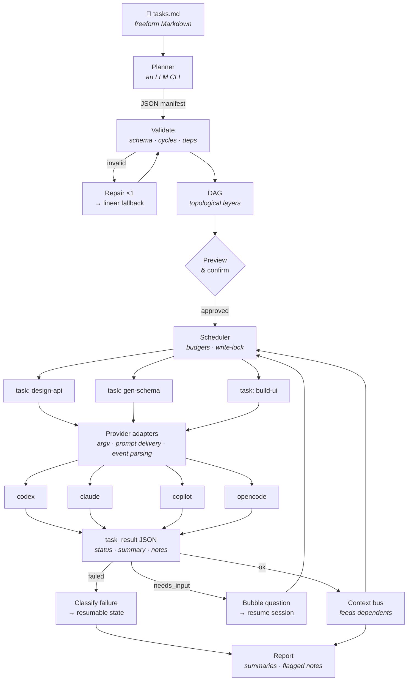

# baya

**Orchestrate local AI coding CLIs from a plain Markdown task list.**

Write what you want done in ordinary Markdown. Baya asks a model to turn it into a dependency graph, then routes each task to the AI coding CLI you already have installed and logged in — `codex`, `claude`, `copilot`, `opencode` — running independent work in parallel and piping each task's output into the ones that depend on it.

No YAML. No DSL. No API keys for every provider — it drives the CLIs you already pay for.

> [!WARNING]
> **Status: pre-implementation.** The design is complete and provider surfaces are verified, but no code has landed yet. Nothing below is installable today. Follow along in [`specs/001/02-plan.md`](specs/001/02-plan.md).

---

## How it works



Four ideas do most of the work:

- **JSON on the wire, both directions.** Every exchange with a provider is a validated envelope, never prose. `codex` and `claude` enforce the result schema natively. A question from an agent is a `status: "needs_input"` field — not a question mark spotted in a stream.
- **The planner picks a provider, never a command.** Manifests carry a provider name from a closed enum; adapters alone build `argv`. `shell: true` is banned repo-wide.
- **Nothing paid-for is ever redone.** Progress is checkpointed before each transition. Run out of credits mid-graph and `baya resume <runId> --provider claude` picks up exactly where it stopped.
- **Providers are watched, not trusted.** Their flag surfaces are live-probed and contract-tested, their output is ANSI-stripped and schema-validated.

## Install

> Not yet published.

```bash
npm install -g baya-cli   # binary: baya
```

Requires **Node 24+** and at least one supported CLI on your machine. Run `baya doctor` to see what it found.

## Usage

```bash
baya ./tasks.md                    # plan it, show it, run it
baya ./tasks.md --dry-run          # show the plan, run nothing
baya ./tasks.md --max-parallel 4
baya runs                          # list interrupted runs
baya resume <runId>                # continue one of them
baya resume <runId> --provider claude   # ...on a different provider
baya doctor                        # check provider installs
baya config                        # change your default provider
```

On first run baya asks once which provider and model to default to, stores it in `~/.config/baya/config.json`, and never asks again.

A `tasks.md` is just Markdown:

```markdown
# Ship the orders endpoint

- Design the REST API for orders. Use Sonnet.
- Generate the DB schema from that design.
- Build the React table that consumes it — run this with codex.
- Once the schema and UI are done, write integration tests.
```

## Providers

Verified 2026-08-28 by live invocation, not from documentation.

| Provider | Non-interactive | Schema enforcement | Status |
| :-- | :-- | :-- | :-- |
| [`codex`](https://github.com/openai/codex) | `codex exec` | ✅ file in / file out | ✅ verified |
| [`claude`](https://claude.com/claude-code) | `claude -p` | ✅ inline `--json-schema` | ✅ verified |
| [`copilot`](https://github.com/github/copilot-cli) | `copilot -p` | ❌ | ⚠️ partial |
| [`opencode`](https://github.com/sst/opencode) | `opencode run` | ❌ | ⚠️ partial |
| [`gemini`](https://github.com/google-gemini/gemini-cli) | `gemini -p` | ❌ | deferred to v1.1 |

Full flag surfaces, event shapes, and capability matrix: [`wiki-llm/providers.md`](wiki-llm/providers.md).

## Repo layout

```
wiki-llm/     documentation — the source of truth
specs/001/    design record: what the original spec got wrong, and the plan
src/          (not yet)
test/         (not yet)
```

## Documentation

[`wiki-llm/index.md`](wiki-llm/index.md) routes to everything — architecture, the JSON protocol, provider surfaces, execution semantics, recovery, logging, CLI reference, testing, and conventions.

Working on baya? Start with [`wiki-llm/conventions.md`](wiki-llm/conventions.md), then [`specs/001/02-plan.md`](specs/001/02-plan.md).

## Contributing

Contributions are welcome — the work is broken into 52 sequenced tasks in [`specs/001/02-plan.md`](specs/001/02-plan.md), each with its own done-criteria, so there is plenty that can be picked up independently.

Before opening a PR:

```bash
npm run typecheck && npm run lint && npm test
```

A few rules that are load-bearing rather than stylistic — the full list is in [`wiki-llm/conventions.md`](wiki-llm/conventions.md):

- No `shell: true`, ever. Spawns take `argv: string[]`.
- Never document a provider flag you have not actually run.
- Never regex a model's prose for meaning — semantics come from validated JSON.
- Update the affected `wiki-llm/` page in the same commit as the change.
- Tests never touch the network; the contract tier is opt-in via `BAYA_CONTRACT=1`.

Adding a provider is deliberately small: one adapter, one capability block, one section in `providers.md`, one contract test.

## FAQ

**Why not just use one CLI's built-in agent?** Because you probably pay for more than one, and they are good at different things. Baya lets a task list say "plan with one, build with another" and handles the plumbing.

**Does this need API keys?** No. It drives locally installed CLIs under whatever subscription you already have.

**Is it safe to run in parallel?** Read-only tasks run concurrently; anything that writes is serialized by the scheduler. One Baya runs per directory — a second is refused rather than left to fight over the same files. To run two task lists against one repo, give each its own `git worktree`.

## License

*TBD.*
